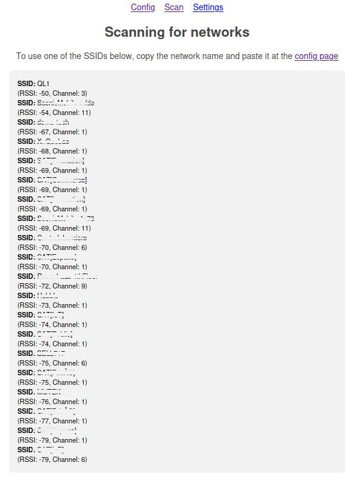
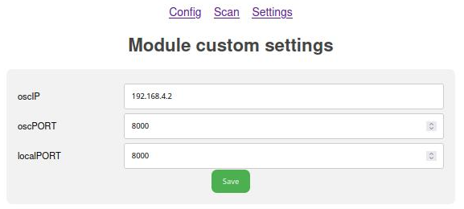

# Browser Pages

This document explains the different browser-accessible pages available to the user for configuring, scanning, and managing settings for their project.

---

## Accessing the Web Server

To access the web server:

1. **Connect to the Network**:
   - Connect to the same network/SSID as the board, or connect to the board's WiFi access point.
2. **Open the Web Server**:
   - Enter the board's IP address in any web browser.
   - Alternatively, type the device's network name followed by `.local` in the browser's address bar.  
     - The default device network name is `device_id` (as defined in the `config.json` file).  
     - Example: If the network name is **Puara_001**, type `puara_001.local` in the browser's address bar.

---

## Config Page

The **Config Page** allows you to manage the network and device configuration parameters.


### Key Parameters:
- **Network SSID and Password**: These are for the external WiFi network you wish to connect to.
- **Puara Password**: This is the password for your device/board's WiFi network, which you can update.

### Important Notes:
- After making changes to these parameters, click the **"Close and Reboot"** button to restart your system and apply the changes.
- See the code parameters in the [config.json](../../data/config.json) file for more details.

### `config.json`

You may modify these values directly in the source files, then build/upload the filesystem. The `/data/config.json` file is used to store the main configuration of your device. Here is an example of a `config.json` file:

```json
{
    "device": "Puara",
    "id": 1,
    "author": "Edu Meneses",
    "institution": "SAT/IDMIL (2025)",
    "APpasswd": "mappings",
    "wifiSSID": "SSID",
    "wifiPSK": "AP_PASSWORD",
    "persistentAP": 1
}
```

*   `device`: User chosen name for the device.
*   `id`: User defined device ID (useful if using multiple devices).
*   `author`: User defined project author.
*   `APpasswd`: password to for your device's WiFi network.
*   `wifiSSID`: Network name you want your device to connect to.
*   `wifiPSK`: Network password you want your device to connect to.
*   `persistent_AP`: If `true`, the device will always create it's own Access Point. Deactivate if you are not using this option to limit radio pollution and increase stability of other signals.

---

## Scan Page

The **Scan Page** displays the WiFi networks detected by your device. 



### Features:
- View a list of available WiFi networks.
- Use the information to update the configuration of your board.
- After updating, reboot the device to apply the changes.

---

## Settings Page

The **Settings Page** allows you to view and modify predefined text or number variables.

### Features:
- Add or delete fields in the [settings.json](../../data/settings.json) file. Ensure the `name:value` structure is respected. Rebuild/Upload filesystem after doing this.
- Modify values directly via the web server settings page. Changes persist after reboot.

### Accessing Variables in Your Program:
- Use `puara.getVarText("name")` for text fields.
- Use `puara.getVarNumber("name")` for number fields.

### Examples:

#### Random Settings (Basic Template)
Example of placeholder names and values found in the basic template:


#### OSC Settings (OSC Templates)
Example of OSC settings for the OSC templates, including IP and port addresses:



### `settings.json`
The `settings.json` file is used to store the settings of your application. You can add any key-value pairs to this file. Here is an example of a `settings.json` file:

```json
{
    "settings": [
        {
            "name": "user_defined_text",
            "value": "user defined value"
        },
        {
            "name": "user_defined_variable",
            "value": 42
        },
        {
            "name": "variable3",
            "value": 12.345
        }
    ]
}
```
You can access the values of these variables from your code using the `getVarNumber()` and `getVarText()` methods of the `Puara` object:

```cpp
std::string my_string_var = puara.getVarText("user_defined_name");
int my_int_var = puara.getVarNumber("user_defined_variable");
float my_float_var = puara.getVarNumber("variable3");
```


---

This document provides an overview of the browser-accessible pages for configuring, scanning, and managing your device's settings. For more details, refer to the respective JSON files or templates.